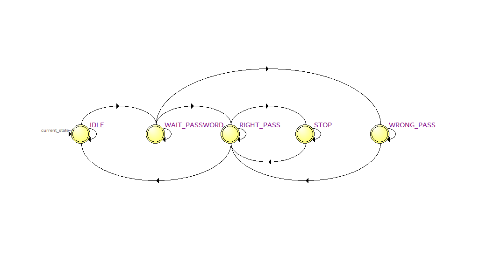

# Parking_System

<!-- PROJECT LOGO -->
 

  

  <h3 align="center">Car Parking System</h3>

  

    Welcome to My Github Page!
     This Repo contains the verilog HDL code to implement a password based car-parking system operator.
     The above picture is the state machine logic implemented.
     Feel free to fork the repo to try and modify the logic to your interest.
  
  You can fine both the verilog code and testbench to it in the repo with a simulation plot.
     
    
  

<!-- ABOUT THE PROJECT -->
## About The Project

### Built With

* Intel Quarus Prime Lite
* Model Sim-Alterra

<!-- GETTING STARTED -->
## Getting Started

To get a local copy up and running follow these simple steps.

### Installation

1. Clone the repo
  
  git clone https://github.com/MeenakshiShankar/parking_system
  
 2. Install Intel Quartus Prime Lite
   
   Download at https://fpgasoftware.intel.com/?edition=lite
 
3. Create a new project and follow the project wizard to setup the environment
   
   Click on Family and choose the Cyclone IV E. Select EP4CE22F17C6 from the Available Device. 
   For Simulation, choose ModelSim-Altera. Also, choose a suitable format (Verilog HDL, VHDL) as per your requirement
 
4. Copy,Paste the Verilog File save it in the module name.Compile it to debug.
   
 5. Copy,Paste the Verilog Testbench File save it in the module name.
   
     In the General category, Select EDA Tool Options.
     A dialogue box appears, where you can specify the path of Modelsim-Altera executable file. And Click OK.
     
     Go to the menu Assignments → Settings.
     Under EDA Tool Settings → Simulation. The dialogue box for simulation appears.
     For Tool Name, Choose Modelsim-Altera.
     Select VHDL or Verilog as the Format for Output Netlist.
     Select simulation/modelsim as the Output Directory.
     Under NativeLink Settings, Choose Compile Test Bench→ Test Benches. 
   
   6. Copy,Paste the Verilog Testbench File save it in the module name.
     
   Goto menu Processing →Start→Start Analysis & Elaboration. 
   After this Click on Processing →Start→Start Analysis & Synthesis on the same drop box.
   These step checks the error and collects all file name information and builds the design hierarchy for simulation.
   
   
   7. Copy,Paste the Verilog File save it in the module name.Compile it to debug.
   
   Go to menu Tools → Run Simulation Tool → RTL Simulation.
   It & automatically run EDA simulator (ModelSim-Altera) and compiles all necessary design files.

<!-- CONTACT -->
## Contact

* Meenakshi Shankar - [@LinkedIn_handle](www.linkedin.com/in/meenakshi-shankar-022961190) 
* Email - meenakshishankar.mec@gmail.com

<!-- ACKNOWLEDGEMENTS -->
## Acknowledgements

* [@Website_Reference](https://www.fpga4student.com/2016/11/verilog-code-for-parking-system-using.ht)

